# Android如何安装JMC?

## Step 1

打开 Fold Craft Launcher 的 Github 页面 [[点我打开]]([FCL-Team/FoldCraftLauncher: Fold Craft Launcher, an Android Minecraft : Java Edition launcher.](https://github.com/FCL-Team/FoldCraftLauncher))

## Step 2

点击 Star

## Step 3

点击 Releases 里带 Latest 的链接

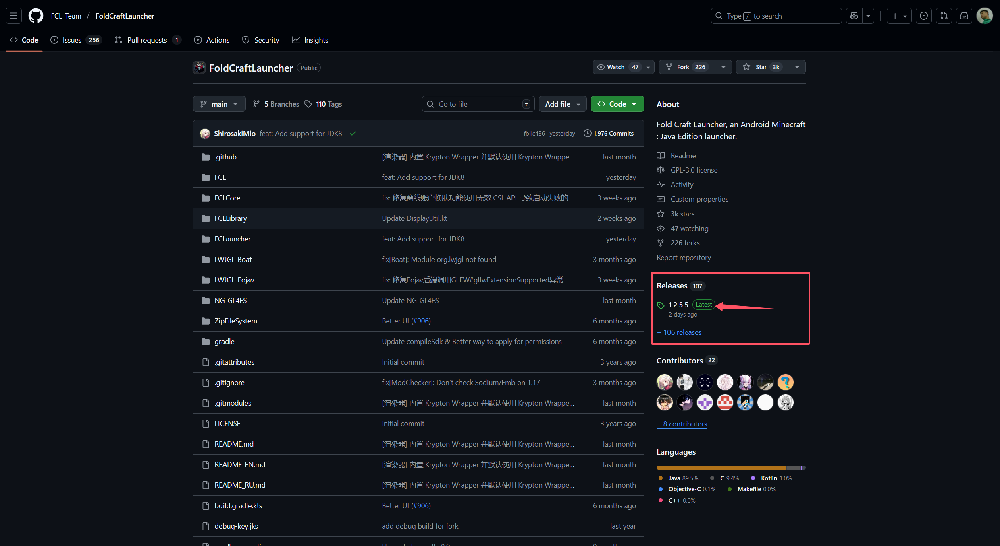

## Step 4

找到适合自己手机架构的安装包下载并安装

## Step 5

打开 JMC 的 Github 页面 [[点我打开]]((https://github.com/IamJokerZHEN/JMC))

## Step 6

点击 Star

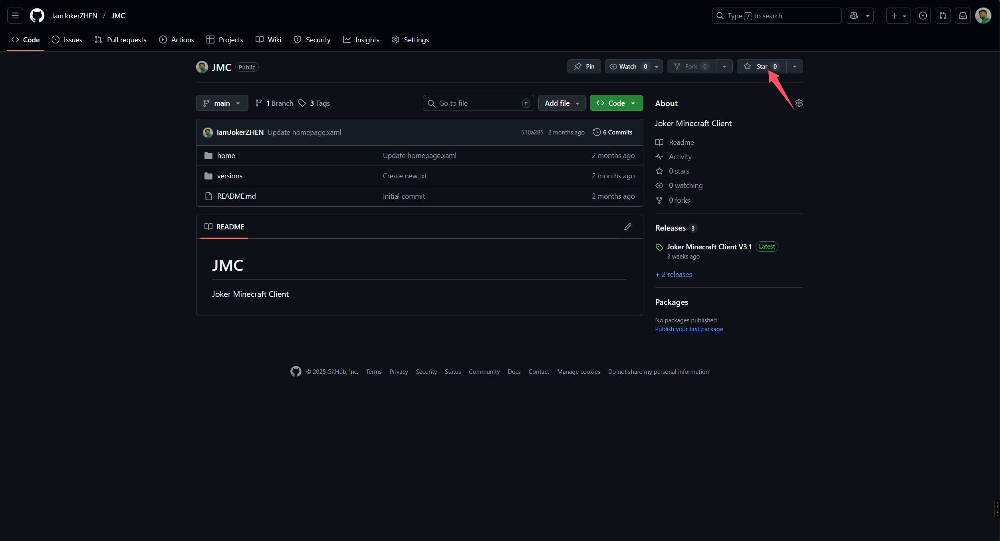

## Step  7

点击 Releases 里带 Latest 的链接

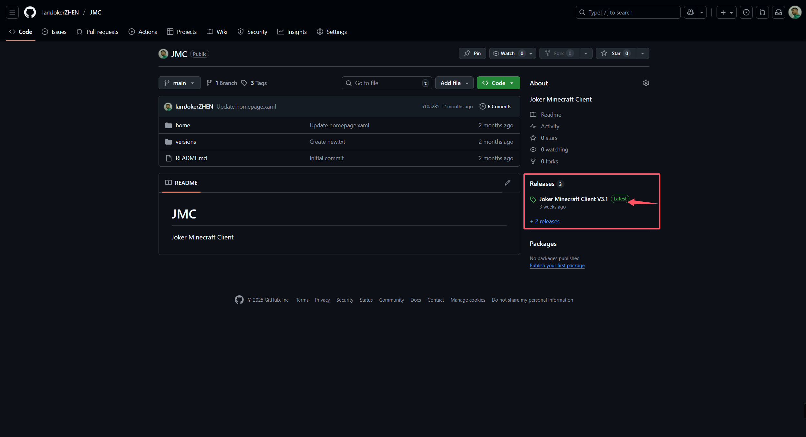

## Step 8

选择在线/离线安装

(部分地区无法下载mod,请下载离线包)

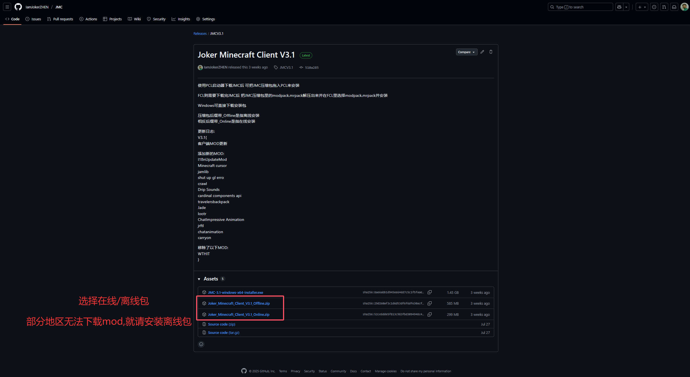 

## Step 9

以下载离线包为例

下载完成后打开 MT管理器(其他解压软件都行) 并找到你下载的离线包打开

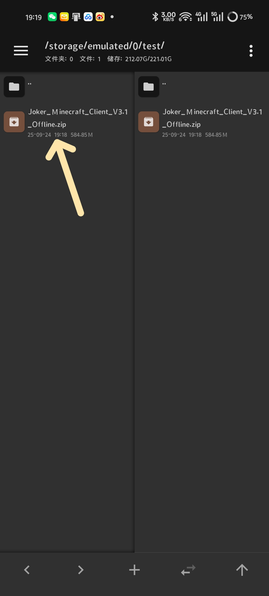

## Step 10

解压modpack.mrpack

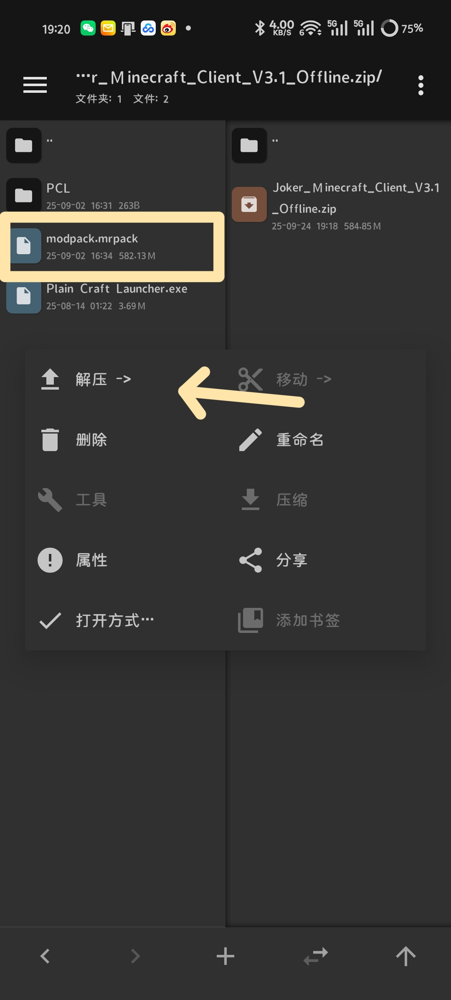

## Step 11

安装Fold Craft Launcher后打开进入主界面

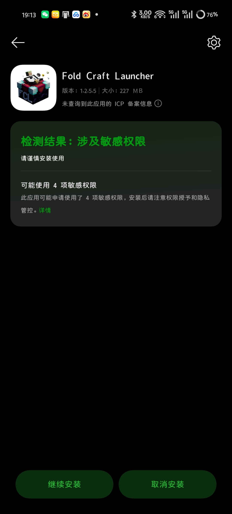

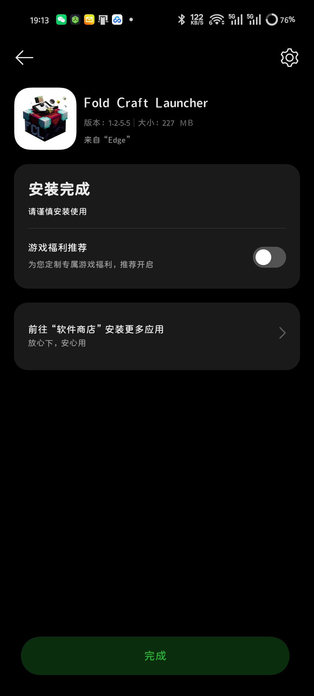

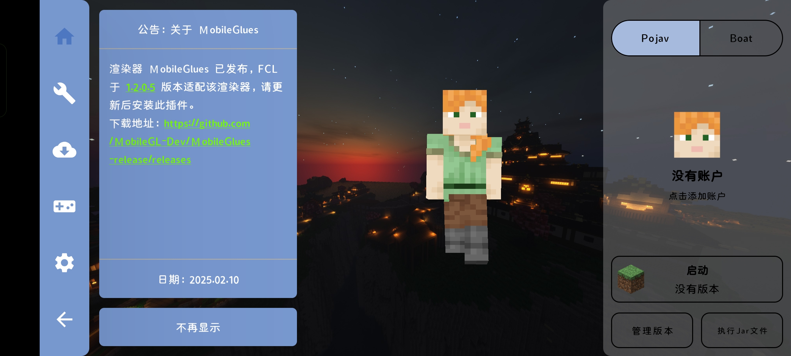

## Step 12

点击 下载

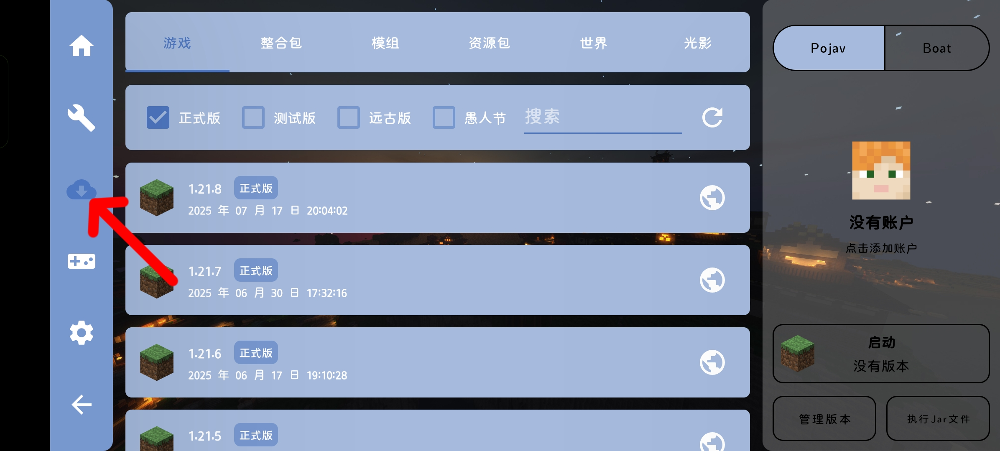

## Step 13

点击 整合包

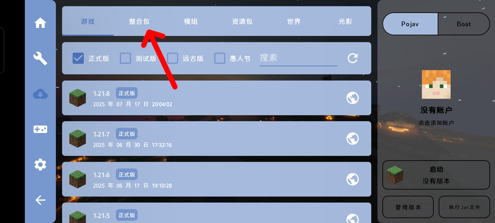

## Step 14

点击 安装整合包

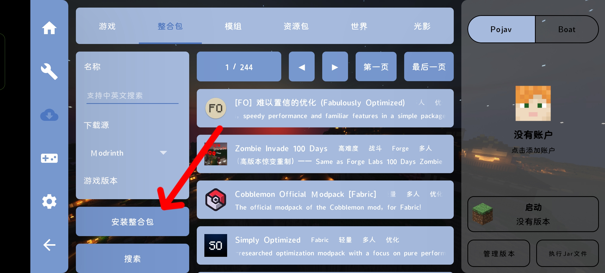

## Step 15

点击导入本地整合包文件

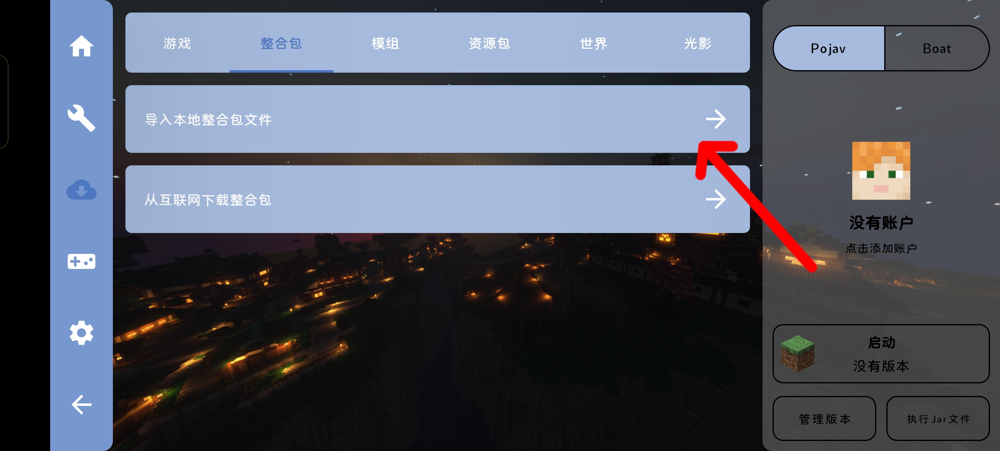

## Step 16

选择你刚刚解压的modpack.mrpack 并点确认

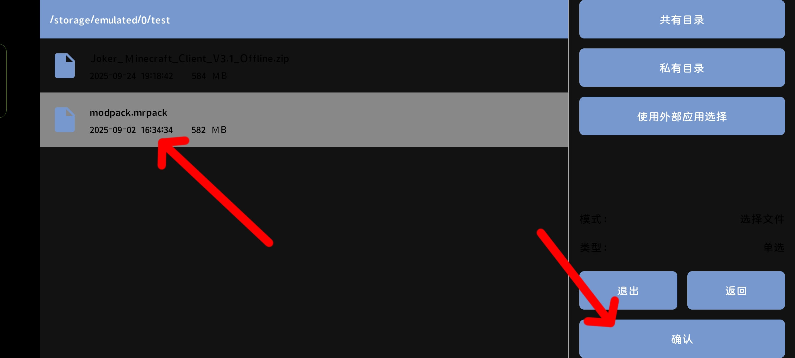

## Step 17

点击 安装

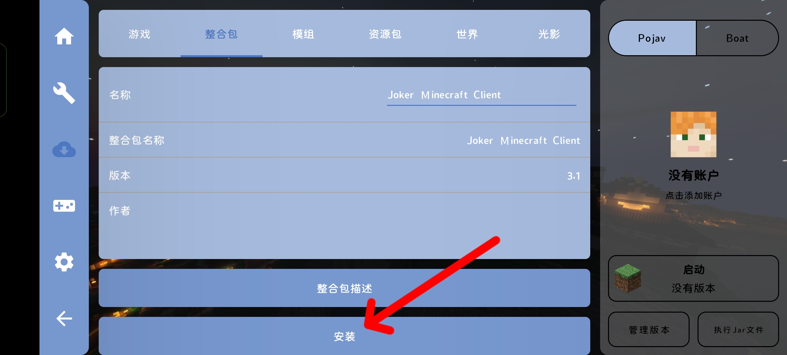

## Step 18

点击 确认

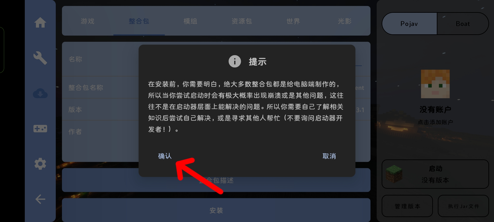

## Step 19

等待JMC安装完成

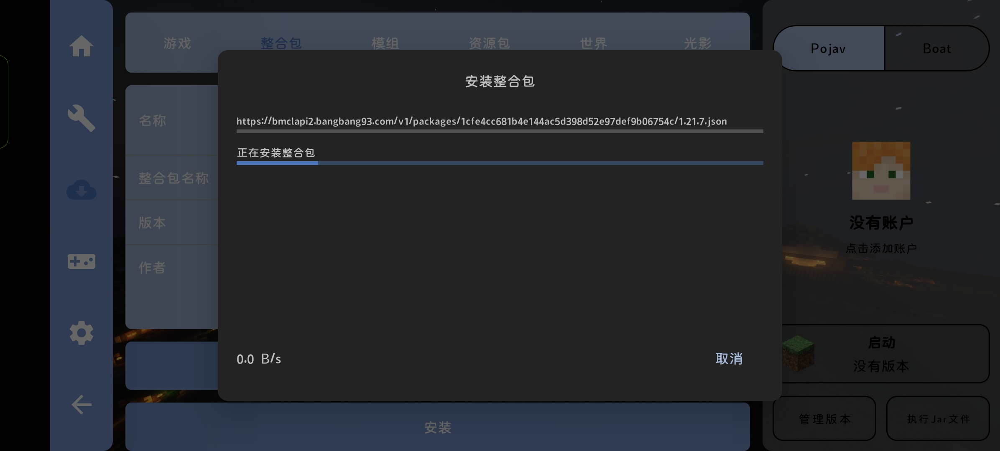

## Step 20

安装成功后点击确认

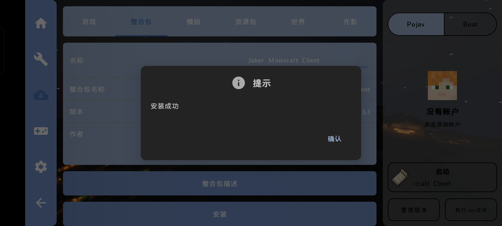

## Step 21

点击 设置

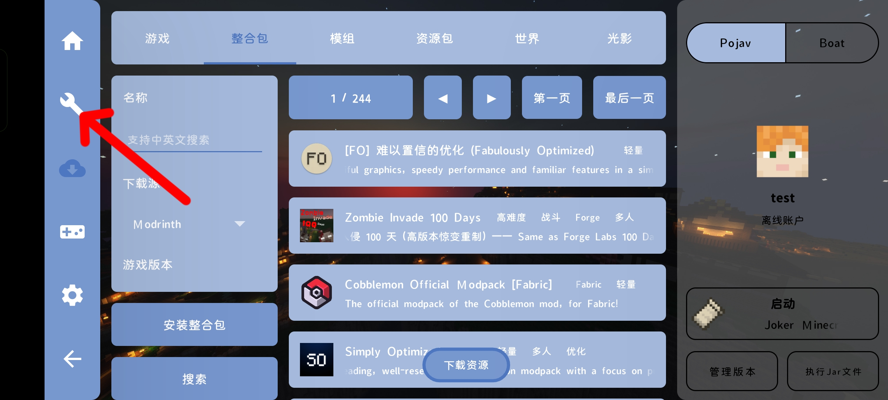

## Step 22

点击 管理模组

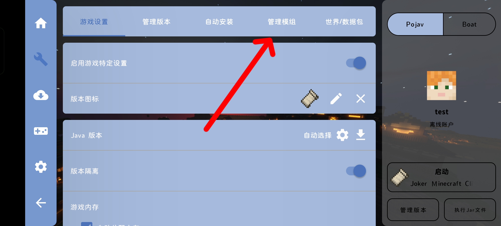

## Step 23

搜索以下Mod并删除/禁用

(以下由于没有FFmpeg插件而无法使用,可以自行下载FFmpeg插件使用)

> Replay Mod
> 
> Replay Voice Chat
> 
> ServerReplay

(以下mod会导致游戏崩溃)

> Controllable
> 
> Minecraft Cursor
> 
> Webcam

## Step 24

添加账户 启动JMC!

## Tips:

如果不习惯FCL的按键可以自行安装以下mod,类似基岩按键

> TouchController
